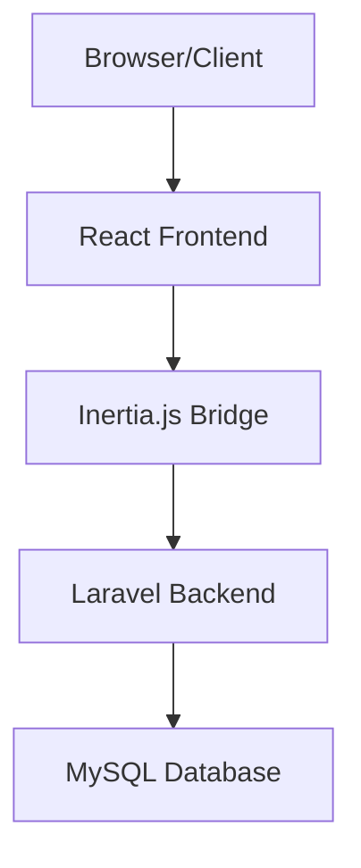

# System Architecture Overview

## High-Level Architecture

Budget Buddy follows a modern full-stack architecture combining Laravel (backend) with React (frontend) using Inertia.js as the glue layer.

## Key Components

### Backend Layer (Laravel)
- **Controllers**: Handle business logic and data processing
- **Models**: Define database relationships and business rules
- **Middleware**: Manage authentication, authorization, and request processing
- **Services**: Handle complex business operations
- **API Routes**: RESTful endpoints for data operations

### Frontend Layer (React)
- **Pages**: Main view components using Inertia.js
- **Components**: Reusable UI components
- **Hooks**: Custom React hooks for shared functionality
- **Utils**: Helper functions and utilities
- **Layouts**: Page layout templates

### Data Layer
- MySQL database with complex relationships
- Migration-based schema management
- Eloquent ORM for data access

## Authentication & Security

- Laravel's built-in authentication system
- Session-based authentication with CSRF protection
- Role-based access control
- Secure password handling and history tracking

## Key Features

1. **Financial Management**
   - Transaction tracking
   - Category management
   - Budget planning

2. **Analysis & Reporting**
   - Income analysis
   - Expense tracking
   - Investment performance
   - Custom reports

3. **Goal Management**
   - Savings goals
   - Progress tracking
   - Automated calculations

4. **Notification System**
   - Custom notification types
   - User preferences
   - Real-time updates

## Technical Stack

- **Backend**: Laravel 10.x
- **Frontend**: React 18.x with JSX
- **Database**: MySQL 8.x
- **State Management**: React Hooks + Inertia.js
- **UI Components**: Custom component library
- **Charting**: Recharts
- **Styling**: Tailwind CSS

## Development & Deployment

- Docker-based development environment
- NPM for frontend package management
- Composer for PHP dependencies
- Automated test suite with PHPUnit and Jest