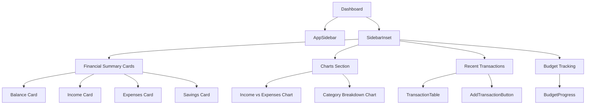

# React Component Architecture

## Component Organization

### Layout Components
```
resources/js/Layouts/
├── AuthenticatedLayout.jsx    # Main authenticated user layout
├── GuestLayout.jsx           # Public pages layout
└── ReportsLayout.jsx         # Specialized reports layout
```

### Page Components
```
resources/js/Pages/
├── Dashboard.jsx             # Main dashboard
├── Goals/                    # Goal management
│   ├── Index.jsx
│   ├── Show.jsx
│   └── components/
│       ├── GoalCard.jsx
│       ├── GoalForm.jsx
│       ├── GoalProgress.jsx
│       ├── ProgressModal.jsx
│       └── SavingsCalculator.jsx
├── Reports/                  # Financial reports
│   ├── BudgetAnalysis.jsx
│   ├── ComparisonReport.jsx
│   ├── Dashboard.jsx
│   └── components/
│       ├── charts/
│       └── shared/
├── Transactions/            # Transaction management
└── Settings/               # User settings
```

## Shared Components

### UI Components
```
resources/js/components/ui/
├── accordion.jsx
├── alert-dialog.jsx
├── button.jsx
├── card.jsx
├── dialog.jsx
├── dropdown-menu.jsx
├── form.jsx
├── input.jsx
├── table.jsx
└── ... (other UI components)
```

### Feature Components
```
resources/js/components/
├── AddTransactionButton.jsx
├── CurrencyDisplay.jsx
├── DeleteTransactionModal.jsx
├── NotificationBell.jsx
├── PaymentMethodAnalysis.jsx
└── ... (other feature components)
```

## Component Hierarchy

### Dashboard Structure


## Component Features

### Smart Components (Container Components)
- Handle data fetching and state management
- Connect to backend APIs
- Manage complex UI logic
- Examples:
  - Dashboard.jsx
  - GoalForm.jsx
  - TransactionSheet.jsx

### Presentational Components (UI Components)
- Focus on UI rendering
- Accept props for data display
- Minimal internal state
- Examples:
  - Button.jsx
  - Card.jsx
  - Table.jsx

## Custom Hooks

### Data Management
```javascript
// Transaction Management
useTransactionSheet.jsx
useTransactionForm.jsx

// Payment Management
usePaymentScheduleSheet.jsx

// UI State Management
useMobile.js
useToast.js
useTransition.jsx
```

## State Management

### Local State
- React useState for component-level state
- useReducer for complex state logic
- Form state management
- UI state (modals, dropdowns, etc.)

### Global State
- React Context for shared state
- Theme context for styling
- Authentication context
- Notification state

## Component Patterns

### Higher Order Components
```javascript
// Authentication wrapper
withAuth(Component)

// Layout wrapper
withLayout(Component)

// Permission checker
withPermissions(Component)
```

### Render Props Pattern
```javascript
// Modal renderer
<Modal>
  {(closeModal) => (
    <ModalContent onClose={closeModal} />
  )}
</Modal>

// Form renderer
<Form>
  {(formState, handleSubmit) => (
    <FormFields {...formState} onSubmit={handleSubmit} />
  )}
</Form>
```

## Component Best Practices

### 1. Component Organization
- Logical folder structure
- Feature-based organization
- Shared components in dedicated folders
- Clear naming conventions

### 2. Props Interface
- Clear prop types
- Default props where appropriate
- Prop validation
- Documentation of required props

### 3. Error Handling
- Error boundaries
- Loading states
- Empty states
- Error messages

### 4. Performance Optimization
- React.memo for expensive renders
- useMemo for complex calculations
- useCallback for callback functions
- Lazy loading for large components

### 5. Testing
- Unit tests for components
- Integration tests for features
- Snapshot testing
- Accessibility testing

## Styling Architecture

### CSS Organization
```
resources/css/
├── app.css                # Global styles
├── components/           # Component-specific styles
└── utilities/           # Utility classes
```

### Tailwind Integration
- Custom configuration
- Component-specific utilities
- Responsive design classes
- Theme customization

## Component Examples

### Form Components
```jsx
// Example of a form component with validation
const TransactionForm = ({ onSubmit }) => {
  const { register, handleSubmit, errors } = useForm();
  
  return (
    <form onSubmit={handleSubmit(onSubmit)}>
      <Input
        {...register("amount")}
        type="number"
        label="Amount"
        error={errors.amount}
      />
      {/* Other form fields */}
    </form>
  );
};
```

### Data Display Components
```jsx
// Example of a data visualization component
const IncomeChart = ({ data }) => {
  return (
    <ChartContainer>
      <LineChart data={data}>
        <XAxis dataKey="date" />
        <YAxis />
        <Line type="monotone" dataKey="amount" />
      </LineChart>
    </ChartContainer>
  );
};
```

## Accessibility Features

### ARIA Integration
- Proper ARIA labels
- Role attributes
- Focus management
- Keyboard navigation

### Responsive Design
- Mobile-first approach
- Breakpoint handling
- Flexible layouts
- Touch-friendly interactions