# BudgetBuddy Sistēmas Analīzes Dokumentācija

## Satura rādītājs
1. [Sistēmas funkcionālā dekompozīcija](#1-sistēmas-funkcionālā-dekompozīcija)
2. [ER diagramma](#2-er-diagramma)
3. [Datu plūsmu diagramma](#3-datu-plūsmu-diagramma)
4. [Tabulu saišu shēma](#4-tabulu-saišu-shēma)

---

## 1. Sistēmas funkcionālā dekompozīcija

BudgetBuddy ir pilnībā funkcionāla budžeta vadības sistēma, kas sastāv no vairākām galvenajām apakšsistēmām:

```mermaid
graph TD
    A[BudgetBuddy Sistēma] --> B[Lietotāju vadība]
    A --> C[Finanšu vadība]
    A --> D[Budžeta vadība]
    A --> E[Mērķu vadība]
    A --> F[Ieguldījumu vadība]
    A --> G[Parādu vadība]
    A --> H[Atskaišu sistēma]
    A --> I[Administrācijas sistēma]
    A --> J[Paziņojumu sistēma]

    B --> B1[Autentifikācija]
    B --> B2[Profila vadība]
    B --> B3[Lomas vadība]
    B --> B4[Valūtas preferences]

    C --> C1[Ieņēmumu vadība]
    C --> C2[Izdevumu vadība]
    C --> C3[Transakciju vadība]
    C --> C4[Kategoriju vadība]
    C --> C5[Maksājumu metožu vadība]
    C --> C6[Valūtas konvertācija]

    D --> D1[Budžeta izveide]
    D --> D2[Budžeta izsekošana]
    D --> D3[Budžeta salīdzināšana]
    D --> D4[Budžeta prognozes]

    E --> E1[Mērķu izveide]
    E --> E2[Progress tracking]
    E --> E3[Uzkrājumu kalkulators]
    E --> E4[Mērķu analīze]

    F --> F1[Ieguldījumu portfelis]
    F --> F2[Performance tracking]
    F --> F3[Asset allocation]
    F --> F4[ROI analīze]

    G --> G1[Kreditoru vadība]
    G --> G2[Maksājumu grafiks]
    G --> G3[Procentu aprēķini]
    G --> G4[Parādu stratēģijas]

    H --> H1[Finanšu atskaites]
    H --> H2[Analītiskie dashboardi]
    H --> H3[Export/Import]
    H --> H4[PDF ģenerēšana]

    I --> I1[Lietotāju administrācija]
    I --> I2[Sistēmas analītika]
    I --> I3[Datu eksports]
    I --> I4[Sistēmas uzraudzība]

    J --> J1[Paziņojumu vadība]
    J --> J2[E-pasta paziņojumi]
    J --> J3[Sistēmas brīdinājumi]
    J --> J4[Paziņojumu preferences]
```

---

## 2. ER Diagramma

Šī diagramma parāda sistēmas galvenās entītijas un to savstarpējās attiecības:

```mermaid
erDiagram
    USERS ||--o{ EARNINGS : creates
    USERS ||--o{ EXPENSES : creates
    USERS ||--o{ BUDGETS : creates
    USERS ||--o{ GOALS : creates
    USERS ||--o{ SAVINGS : creates
    USERS ||--o{ INVESTMENTS : creates
    USERS ||--o{ CREDITORS : manages
    USERS ||--o{ NOTIFICATIONS : receives
    USERS ||--o{ TRANSACTIONS : performs
    USERS }o--|| CURRENCIES : "has default"
    USERS }o--|| COUNTRIES : "belongs to"
    USERS }o--|| ROLES : "has role"

    EARNINGS }o--|| EARNING_CATEGORIES : categorized
    EXPENSES }o--|| EXPENSE_CATEGORIES : categorized
    TRANSACTIONS }o--|| CATEGORIES : categorized
    TRANSACTIONS }o--|| PAYMENT_METHODS : "paid via"
    TRANSACTIONS }o--|| CURRENCIES : "in currency"

    BUDGETS }o--|| EXPENSE_CATEGORIES : "for category"
    BUDGETS }o--|| CURRENCIES : "in currency"

    GOALS }o--|| EXPENSE_CATEGORIES : "related to"
    GOALS ||--o{ GOAL_TRANSACTIONS : "has transactions"
    GOALS }o--|| CURRENCIES : "in currency"

    SAVINGS }o--|| EXPENSE_CATEGORIES : "related to"
    SAVINGS }o--|| CURRENCIES : "in currency"

    INVESTMENTS }o--|| INVESTMENT_CATEGORIES : categorized
    INVESTMENTS }o--|| CURRENCIES : "in currency"
    INVESTMENTS ||--o{ INVESTMENT_TRANSACTIONS : "has transactions"
    INVESTMENTS ||--o{ INVESTMENT_PERFORMANCE_LOGS : "tracks performance"

    CREDITORS ||--o{ PAYMENT_SCHEDULES : "has schedules"

    EXPENSE_CATEGORIES }o--|| SUB_CATEGORIES : "has subcategories"
    EARNING_CATEGORIES }o--|| SUB_CATEGORIES : "has subcategories"

    NOTIFICATIONS }o--|| NOTIFICATION_TYPES : "of type"
    USERS ||--o{ NOTIFICATION_SETTINGS : "configures"

    USERS {
        bigint id PK
        string name
        string email UK
        timestamp email_verified_at
        string password
        string phone
        text goals
        string role
        string avatar
        bigint currency_id FK
        bigint country_id FK
        json displayed_currencies
        timestamp last_seen
        timestamps created_at
        timestamps updated_at
    }

    CURRENCIES {
        bigint id PK
        string code UK
        string name
        string symbol
        decimal exchange_rate
        boolean is_base
        boolean is_active
        timestamp last_updated
        timestamps created_at
        timestamps updated_at
    }

    EARNING_CATEGORIES {
        bigint id PK
        bigint user_id FK
        bigint parent_id FK
        string name
        text description
        string icon
        string icon_color
        string bg_color
        boolean is_system
        boolean is_fixed_type
        timestamps created_at
        timestamps updated_at
        timestamp deleted_at
    }

    EXPENSE_CATEGORIES {
        bigint id PK
        bigint user_id FK
        bigint parent_id FK
        string name
        text description
        string icon
        string icon_color
        string bg_color
        boolean is_system
        boolean is_fixed_type
        timestamps created_at
        timestamps updated_at
        timestamp deleted_at
    }

    EARNINGS {
        bigint id PK
        bigint user_id FK
        bigint category_id FK
        bigint currency_id FK
        string name
        decimal amount
        date date
        text description
        timestamps created_at
        timestamps updated_at
        timestamp deleted_at
    }

    EXPENSES {
        bigint id PK
        bigint user_id FK
        bigint category_id FK
        bigint currency_id FK
        string name
        decimal amount
        date date
        text description
        bigint payment_method_id FK
        timestamps created_at
        timestamps updated_at
        timestamp deleted_at
    }

    TRANSACTIONS {
        bigint id PK
        bigint user_id FK
        bigint category_id FK
        bigint currency_id FK
        string name
        decimal amount
        enum type
        date date
        text description
        string payment_method
        boolean is_recurring
        string recurring_frequency
        timestamps created_at
        timestamps updated_at
    }

    BUDGETS {
        bigint id PK
        bigint user_id FK
        bigint category_id FK
        bigint currency_id FK
        string name
        decimal amount
        date start_date
        date end_date
        string time_frame
        timestamps created_at
        timestamps updated_at
        timestamp deleted_at
    }

    GOALS {
        bigint id PK
        bigint user_id FK
        bigint category_id FK
        bigint currency_id FK
        string title
        decimal target_amount
        decimal current_amount
        date target_date
        text description
        enum status
        timestamps created_at
        timestamps updated_at
        timestamp deleted_at
    }

    SAVINGS {
        bigint id PK
        bigint user_id FK
        bigint category_id FK
        bigint currency_id FK
        string name
        text description
        decimal target_amount
        decimal current_amount
        date target_date
        enum status
        timestamps created_at
        timestamps updated_at
        timestamp deleted_at
    }

    INVESTMENTS {
        bigint id PK
        bigint user_id FK
        bigint investment_category_id FK
        bigint currency_id FK
        string name
        string symbol
        text description
        decimal initial_amount
        decimal current_amount
        string status
        date purchase_date
        text notes
        timestamps created_at
        timestamps updated_at
    }

    CREDITORS {
        bigint id PK
        bigint user_id FK
        string name
        decimal amount_owed
        decimal interest_rate
        date due_date
        decimal minimum_payment
        string status
        string payment_frequency
        timestamps created_at
        timestamps updated_at
    }

    PAYMENT_SCHEDULES {
        bigint id PK
        bigint user_id FK
        bigint category_id FK
        string name
        decimal amount
        date due_date
        string type
        string status
        boolean is_recurring
        string frequency
        timestamps created_at
        timestamps updated_at
    }

    NOTIFICATIONS {
        bigint id PK
        bigint user_id FK
        bigint notification_type_id FK
        string title
        text message
        boolean is_read
        timestamp read_at
        json data
        timestamps created_at
        timestamps updated_at
    }
```

---

## 3. Datu plūsmu diagramma

Šī diagramma parāda, kā dati plūst sistēmā starp dažādajiem komponentiem:

```mermaid
flowchart TD
    %% External entities
    USER[👤 Lietotājs]
    ADMIN[👨‍💼 Administrators]
    EMAIL_SYS[📧 E-pasta sistēma]
    BANK_API[🏦 Bankas API]

    %% Main processes
    AUTH[🔐 Autentifikācija]
    TRANS_MGT[💰 Transakciju vadība]
    BUDGET_MGT[📊 Budžeta vadība]
    GOAL_MGT[🎯 Mērķu vadība]
    INVEST_MGT[📈 Ieguldījumu vadība]
    REPORT_GEN[📋 Atskaišu ģenerēšana]
    NOTIF_SYS[🔔 Paziņojumu sistēma]
    ADMIN_SYS[⚙️ Administrācijas sistēma]

    %% Data stores
    USER_DB[(👥 Lietotāju DB)]
    TRANS_DB[(💳 Transakciju DB)]
    BUDGET_DB[(📈 Budžeta DB)]
    GOAL_DB[(🎯 Mērķu DB)]
    INVEST_DB[(📊 Ieguldījumu DB)]
    NOTIF_DB[(🔔 Paziņojumu DB)]
    CURRENCY_DB[(💱 Valūtu DB)]

    %% User flows
    USER -->|Pieteikšanās| AUTH
    USER -->|Transakciju dati| TRANS_MGT
    USER -->|Budžeta iestatījumi| BUDGET_MGT
    USER -->|Mērķu definēšana| GOAL_MGT
    USER -->|Ieguldījumu dati| INVEST_MGT
    USER -->|Atskaišu pieprasījumi| REPORT_GEN

    %% Authentication flow
    AUTH -->|Validācija| USER_DB
    AUTH -->|Lietotāja sesija| USER

    %% Transaction management
    TRANS_MGT -->|Saglabā transakcijas| TRANS_DB
    TRANS_MGT -->|Atjaunina budžetu| BUDGET_DB
    TRANS_MGT -->|Atjaunina mērķus| GOAL_DB
    TRANS_MGT -->|Valūtas konvertācija| CURRENCY_DB
    TRANS_MGT -->|Transakciju apstiprinājumi| USER

    %% Budget management
    BUDGET_MGT -->|Saglabā budžetus| BUDGET_DB
    BUDGET_MGT -->|Nolasa transakcijas| TRANS_DB
    BUDGET_MGT -->|Budžeta statuss| USER
    BUDGET_MGT -->|Brīdinājumi| NOTIF_SYS

    %% Goal management
    GOAL_MGT -->|Saglabā mērķus| GOAL_DB
    GOAL_MGT -->|Nolasa transakcijas| TRANS_DB
    GOAL_MGT -->|Progress atjauninājumi| USER
    GOAL_MGT -->|Mērķu paziņojumi| NOTIF_SYS

    %% Investment management
    INVEST_MGT -->|Saglabā ieguldījumus| INVEST_DB
    INVEST_MGT -->|Tirgus dati| BANK_API
    INVEST_MGT -->|Performance atskaites| USER

    %% Reporting system
    REPORT_GEN -->|Nolasa visus datus| TRANS_DB
    REPORT_GEN -->|Nolasa budžetus| BUDGET_DB
    REPORT_GEN -->|Nolasa mērķus| GOAL_DB
    REPORT_GEN -->|Nolasa ieguldījumus| INVEST_DB
    REPORT_GEN -->|PDF/Excel atskaites| USER

    %% Notification system
    NOTIF_SYS -->|Saglabā paziņojumus| NOTIF_DB
    NOTIF_SYS -->|E-pasta paziņojumi| EMAIL_SYS
    NOTIF_SYS -->|Push paziņojumi| USER
    EMAIL_SYS -->|E-pasti| USER

    %% Admin flows
    ADMIN -->|Sistēmas vadība| ADMIN_SYS
    ADMIN_SYS -->|Lietotāju analītika| USER_DB
    ADMIN_SYS -->|Sistēmas statistika| TRANS_DB
    ADMIN_SYS -->|Administrācijas atskaites| ADMIN

    %% External data flows
    BANK_API -->|Valūtu kursi| CURRENCY_DB
    CURRENCY_DB -->|Kursu atjauninājumi| TRANS_MGT

    %% Automatic processes
    BUDGET_MGT -.->|Automātiskie brīdinājumi| NOTIF_SYS
    GOAL_MGT -.->|Progress paziņojumi| NOTIF_SYS
    INVEST_MGT -.->|Performance ziņojumi| NOTIF_SYS

    %% Data validation flows
    TRANS_MGT -.->|Validācija| USER_DB
    BUDGET_MGT -.->|Validācija| USER_DB
    GOAL_MGT -.->|Validācija| USER_DB
    INVEST_MGT -.->|Validācija| USER_DB

    style USER fill:#e1f5fe
    style ADMIN fill:#f3e5f5
    style EMAIL_SYS fill:#fff3e0
    style BANK_API fill:#e8f5e8
```

---

## 4. Tabulu saišu shēma

Šī diagramma detalizēti parāda datu bāzes tabulu struktūru un to savstarpējās saites:

```mermaid
erDiagram
    %% Core user management tables
    users ||--o{ earnings : "user_id"
    users ||--o{ expenses : "user_id"
    users ||--o{ budgets : "user_id"
    users ||--o{ goals : "user_id"
    users ||--o{ savings : "user_id"
    users ||--o{ investments : "user_id"
    users ||--o{ creditors : "user_id"
    users ||--o{ payment_schedules : "user_id"
    users ||--o{ transactions : "user_id"
    users ||--o{ notifications : "user_id"
    users ||--o{ notification_settings : "user_id"
    users }o--|| currencies : "currency_id"
    users }o--|| countries : "country_id"
    users }o--|| roles : "role"

    %% Category relationships
    earning_categories ||--o{ earnings : "category_id"
    expense_categories ||--o{ expenses : "category_id"
    expense_categories ||--o{ budgets : "category_id"
    expense_categories ||--o{ goals : "category_id"
    expense_categories ||--o{ savings : "category_id"
    expense_categories ||--o{ payment_schedules : "category_id"

    earning_categories ||--o{ sub_categories : "parent_id"
    expense_categories ||--o{ sub_categories : "parent_id"

    %% Investment relationships
    investment_categories ||--o{ investments : "investment_category_id"
    investments ||--o{ investment_transactions : "investment_id"
    investments ||--o{ investment_performance_logs : "investment_id"

    %% Currency relationships
    currencies ||--o{ earnings : "currency_id"
    currencies ||--o{ expenses : "currency_id"
    currencies ||--o{ budgets : "currency_id"
    currencies ||--o{ goals : "currency_id"
    currencies ||--o{ savings : "currency_id"
    currencies ||--o{ investments : "currency_id"
    currencies ||--o{ transactions : "currency_id"

    %% Payment and transaction relationships
    payment_methods ||--o{ expenses : "payment_method_id"
    creditors ||--o{ payment_schedules : "creditor_id"

    %% Goal relationships
    goals ||--o{ goal_transactions : "goal_id"

    %% Notification relationships
    notification_types ||--o{ notifications : "notification_type_id"

    %% Tag relationships (many-to-many through pivot)
    tags }o--o{ expenses : "expense_tags"
    tags }o--o{ earnings : "earning_tags"

    %% Auth related tables
    users ||--o{ password_history : "user_id"
    users ||--o{ sessions : "user_id"

    %% Import/Export tables
    users ||--o{ imports : "user_id"
    users ||--o{ exports : "user_id"
    imports ||--o{ failed_import_rows : "import_id"

    %% Reports tables
    users ||--o{ expenses_reports : "user_id"
    users ||--o{ earning_reports : "user_id"

    %% Income analysis
    users ||--o{ income_analyses : "user_id"

    %% Table definitions with key fields
    users {
        bigint id PK
        string name
        string email UK
        string password
        string phone
        bigint currency_id FK
        bigint country_id FK
        string role
        json displayed_currencies
        timestamp last_seen
        timestamps created_updated
    }

    currencies {
        bigint id PK
        string code UK "USD, EUR, GBP"
        string name
        string symbol
        decimal exchange_rate "precision 10,6"
        boolean is_base
        boolean is_active
        timestamp last_updated
    }

    earning_categories {
        bigint id PK
        bigint user_id FK
        bigint parent_id FK "self-reference"
        string name
        text description
        string icon
        boolean is_system
        boolean is_fixed_type
    }

    expense_categories {
        bigint id PK
        bigint user_id FK
        bigint parent_id FK "self-reference"
        string name
        text description
        string icon
        boolean is_system
        boolean is_fixed_type
    }

    sub_categories {
        bigint id PK
        string name
        text description
        bigint parent_id FK "polymorphic"
        string parent_type "earning/expense"
    }

    earnings {
        bigint id PK
        bigint user_id FK
        bigint category_id FK
        bigint currency_id FK
        string name
        decimal amount "15,4"
        date date
        text description
        decimal exchange_rate "10,6"
        decimal base_amount "15,4"
    }

    expenses {
        bigint id PK
        bigint user_id FK
        bigint category_id FK
        bigint currency_id FK
        bigint payment_method_id FK
        string name
        decimal amount "15,4"
        date date
        text description
        decimal exchange_rate "10,6"
        decimal base_amount "15,4"
    }

    transactions {
        bigint id PK
        bigint user_id FK
        bigint category_id FK
        bigint currency_id FK
        string name
        decimal amount "15,4"
        enum type "income/expense"
        date date
        text description
        string payment_method
        boolean is_recurring
        string recurring_frequency
    }

    budgets {
        bigint id PK
        bigint user_id FK
        bigint category_id FK
        bigint currency_id FK
        string name
        decimal amount "12,2"
        date start_date
        date end_date
        string time_frame "monthly/yearly"
    }

    goals {
        bigint id PK
        bigint user_id FK
        bigint category_id FK
        bigint currency_id FK
        string title
        decimal target_amount "12,2"
        decimal current_amount "12,2"
        date target_date
        enum status "active/completed/cancelled"
    }

    savings {
        bigint id PK
        bigint user_id FK
        bigint category_id FK
        bigint currency_id FK
        string name
        decimal target_amount "12,2"
        decimal current_amount "12,2"
        date target_date
        enum status "active/completed/cancelled"
    }

    investments {
        bigint id PK
        bigint user_id FK
        bigint investment_category_id FK
        bigint currency_id FK
        string name
        string symbol
        decimal initial_amount "15,2"
        decimal current_amount "15,2"
        string status
        date purchase_date
    }

    creditors {
        bigint id PK
        bigint user_id FK
        string name
        decimal amount_owed "12,2"
        decimal interest_rate "5,2"
        date due_date
        decimal minimum_payment "8,2"
        enum status "active/paid/cancelled"
        string payment_frequency
    }

    payment_schedules {
        bigint id PK
        bigint user_id FK
        bigint category_id FK
        bigint creditor_id FK
        string name
        decimal amount "12,2"
        date due_date
        enum type "income/expense"
        enum status "pending/completed/cancelled"
        boolean is_recurring
        string frequency
    }

    notifications {
        bigint id PK
        bigint user_id FK
        bigint notification_type_id FK
        string title
        text message
        boolean is_read
        timestamp read_at
        json data
    }

    investment_categories {
        bigint id PK
        string name
        text description
        string icon
    }

    investment_transactions {
        bigint id PK
        bigint investment_id FK
        enum type "buy/sell/dividend"
        decimal amount "15,2"
        decimal quantity "15,6"
        decimal price "15,6"
        date transaction_date
    }

    investment_performance_logs {
        bigint id PK
        bigint investment_id FK
        decimal value "15,2"
        decimal return_amount "15,2"
        decimal return_percentage "5,2"
        date date
    }

    goal_transactions {
        bigint id PK
        bigint goal_id FK
        bigint user_id FK
        decimal amount "12,2"
        enum type "deposit/withdrawal"
        date transaction_date
        text description
    }

    payment_methods {
        bigint id PK
        string name
        text description
        string icon
        boolean is_active
    }

    notification_types {
        bigint id PK
        string name
        string slug UK
        text description
        boolean is_active
    }

    notification_settings {
        bigint id PK
        bigint user_id FK
        bigint notification_type_id FK
        boolean email_enabled
        boolean push_enabled
        json settings
    }

    countries {
        bigint id PK
        string name
        string code "ISO 2-letter"
        string currency_code
    }

    roles {
        bigint id PK
        string name UK
        string slug UK
        text description
        json permissions
    }

    tags {
        bigint id PK
        string name UK
        string color
        text description
    }

    password_history {
        bigint id PK
        bigint user_id FK
        string password_hash
        timestamp created_at
    }

    sessions {
        string id PK
        bigint user_id FK
        string ip_address "45"
        integer last_activity
    }

    imports {
        bigint id PK
        bigint user_id FK
        string filename
        string type "csv/excel"
        enum status "pending/processing/completed/failed"
        json mapping
        integer total_rows
        integer processed_rows
        integer failed_rows
    }

    exports {
        bigint id PK
        bigint user_id FK
        string filename
        string type "pdf/excel/csv"
        enum status "pending/processing/completed/failed"
        json filters
        string file_path
        integer progress
    }

    failed_import_rows {
        bigint id PK
        bigint import_id FK
        integer row_number
        json row_data
        json errors
    }

    expenses_reports {
        bigint id PK
        bigint user_id FK
        string title
        date start_date
        date end_date
        json filters
        json data
    }

    earning_reports {
        bigint id PK
        bigint user_id FK
        string title
        date start_date
        date end_date
        json filters
        json data
    }

    income_analyses {
        bigint id PK
        bigint user_id FK
        string period "monthly/quarterly/yearly"
        decimal total_income "15,2"
        decimal average_income "15,2"
        json category_breakdown
        json trends
        date analysis_date
    }
```

---

## Sistēmas arhitektūras kopsavilkums

### Galvenās sistēmas komponentes:
1. **Lietotāju vadības sistēma** - autentifikācija, profili, lomas
2. **Finanšu vadības kodols** - ieņēmumi, izdevumi, transakcijas
3. **Budžeta plānošanas sistēma** - budžetu izveide un izsekošana
4. **Mērķu vadības sistēma** - finanšu mērķu plānošana un progress
5. **Ieguldījumu portfelis** - ieguldījumu izsekošana un analīze
6. **Parādu vadības sistēma** - kreditoru un maksājumu vadība
7. **Atskaišu un analītikas sistēma** - dažādu veidu atskaites
8. **Paziņojumu sistēma** - automātiski brīdinājumi un paziņojumi
9. **Administrācijas sistēma** - sistēmas vadība un uzraudzība

### Tehnoloģiju steks:
- **Backend**: Laravel (PHP)
- **Frontend**: React.js ar Inertia.js
- **Datu bāze**: MySQL/PostgreSQL
- **Stilošana**: Tailwind CSS
- **Diagrammas**: Mermaid
- **Autentifikācija**: Laravel Sanctum
- **Paziņojumi**: Laravel Notifications

### Galvenās funkcionalitātes:
- Multi-valūtu atbalsts ar automātisko konvertāciju
- Reāllaika budžeta izsekošana
- Investīciju portfeļa vadība
- Automatizēti maksājumu grafiki
- Detalizētas finansiālās atskaites
- Mērķu sasniegšanas izsekošana
- Parādu vadības rīki
- Administrācijas un analītikas dashboard
- Datu imports/eksports
- Paziņojumu sistēma

Šī sistēma nodrošina pilnīgu personālo finanšu vadības risinājumu ar modernu arhitektūru un plašām funkcionalitātēm.